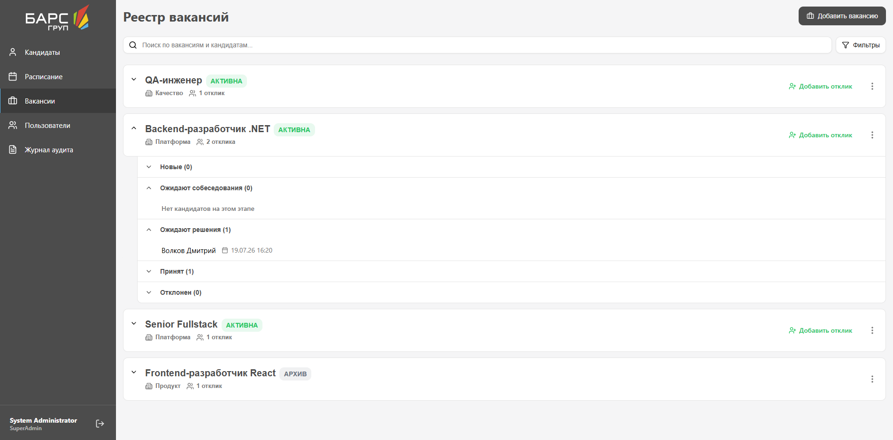
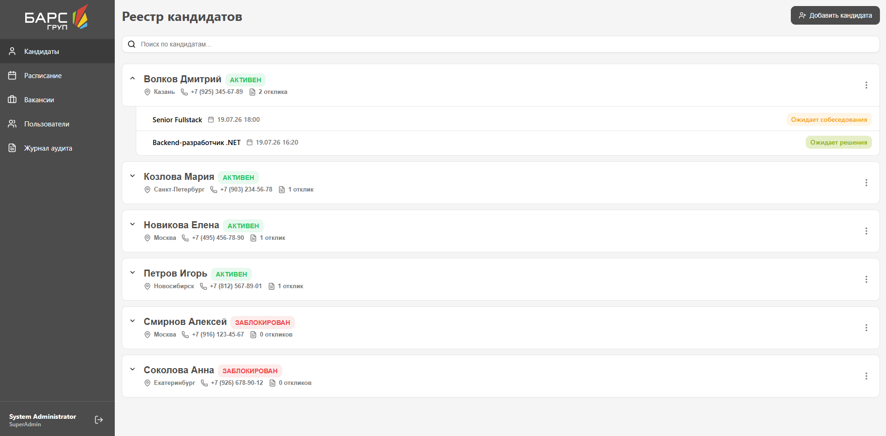
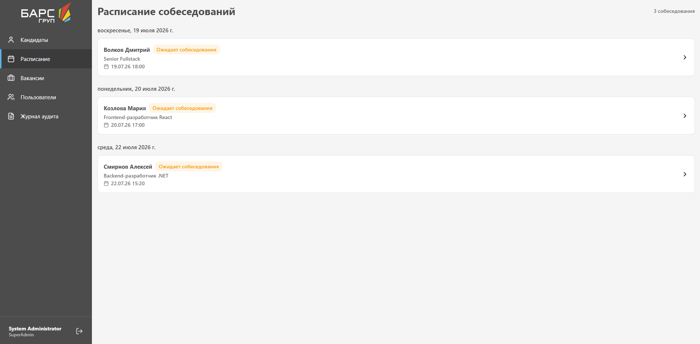
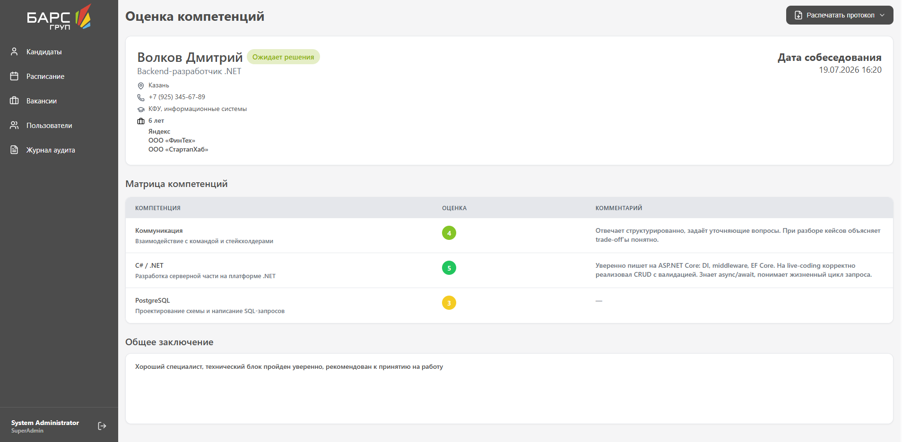
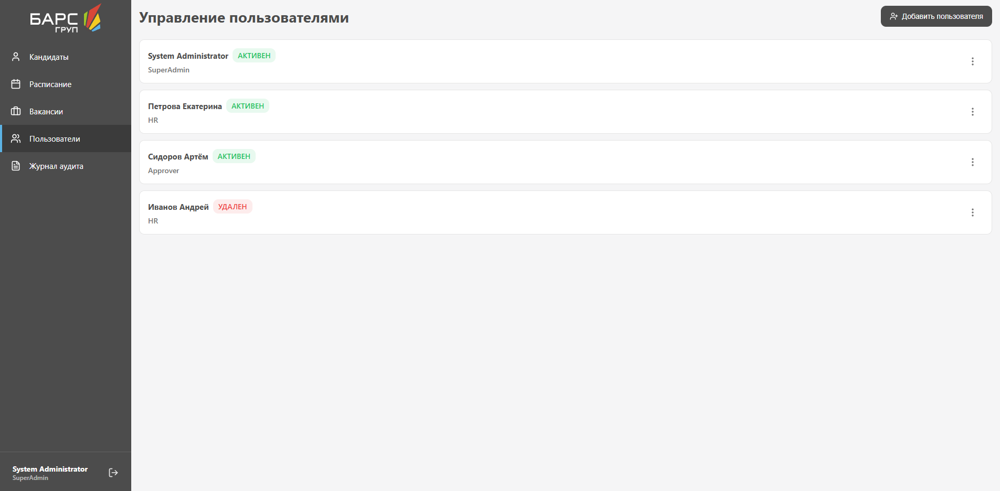

# TalentHunt — ATS (Applicant Tracking System) для автоматизации процессов подбора персонала.

Веб-приложение для HR-специалистов: управление кандидатами и вакансиями, расписание собеседований, оценка компетенций, генерация PDF-документов и контроль прав доступа.

## О проекте

TalentHunt состоит из React-фронтенда и ASP.NET Core API с PostgreSQL. Основные разделы:

- **Кандидаты** — реестр, карточка, отклики на вакансии, статусы этапов найма
- **Вакансии** — создание и согласование вакансий, привязка компетенций
- **Расписание** — планирование и проведение собеседований
- **Оценка** — оценка компетенций кандидата по итогам собеседования
- **Пользователи** — управление учётными записями и правами доступа
- **Журнал аудита** — история действий пользователей в системе

Дополнительно: глобальный поиск по сущностям, генерация PDF (карточка кандидата, приглашение, отказ, протокол собеседования).

**Стек**


Backend построен по слоям: **API** (HTTP, Swagger), **Application** (бизнес-логика), **Infrastructure** (EF Core, PostgreSQL, PDF).

---

## Скриншоты

| Вакансии |
|----------|
|  |

| Кандидаты |
|-----------|
|  |

| Расписание |
|------------|
|  |

| Оценка компетенций |
|--------------------|
|  |

| Пользователи |
|--------------|
|  |

---

## Запуск

### Docker

```bash
git clone https://github.com/bars-practice/TalentHunt.git
cd TalentHunt
```

Файл `.env` в корне:

```env
POSTGRES_USER=postgres
POSTGRES_PASSWORD=password
POSTGRES_DB=TalentHunt
POSTGRES_PORT=5432

BACKEND_PORT=5105
FRONTEND_PORT=80
```

```bash
docker compose up -d
```

| Сервис | URL |
|--------|-----|
| Frontend | http://localhost |
| Backend API | http://localhost:5105/api |

При первом запуске backend автоматически применяются миграции БД, а для входа сразу доступна учётная запись администратора:

```
Логин: admin
Пароль: admin
```

### Локальная разработка

**1. База данных**

Файл `.env` в корне:

```env
POSTGRES_USER=talenthuntuser
POSTGRES_PASSWORD=huntatalent
POSTGRES_DB=talenthunt
POSTGRES_PORT=5432
```

```bash
docker compose -f docker-compose.dev.yml up -d
```

PostgreSQL будет доступен на `localhost:5432`.

**2. Backend**

```bash
cd backend
dotnet restore
dotnet ef database update --project TalentHunt.Infrastructure --startup-project TalentHunt.API
```

Строка подключения задаётся в `backend/TalentHunt.API/appsettings.Development.json` (значения должны совпадать с `.env`):

```json
{
  "ConnectionStrings": {
    "DefaultConnection": "Host=localhost;Port=5432;Database=talenthunt;Username=talenthuntuser;Password=huntatalent;"
  }
}
```

```bash
dotnet run --project TalentHunt.API
```

| Сервис | URL |
|--------|-----|
| Backend API | http://localhost:5105/api |
| Swagger | http://localhost:5105/swagger |

При первом запуске backend автоматически применяются миграции БД, а для входа сразу доступна учётная запись администратора:
```
Логин: admin
Пароль: admin
```

**3. Frontend**

```bash
cd frontend
npm install
```

Файл `frontend/.env`:

```env
VITE_API_BASE_URL=http://localhost:5105/api
```

```bash
npm run dev
```

Остановить базу:

```bash
docker compose -f docker-compose.dev.yml down
```

Удалить данные БД:

```bash
docker compose -f docker-compose.dev.yml down -v
```

## CI/CD

Pipeline описан в `.github/workflows/deploy.yml` и срабатывает при каждом push в ветку `main`.

### Процесс сборки и деплоя

```
push в main
    │
    ▼
┌─────────────────────────────────────┐
│  GitHub Actions: Build & Deploy     │
├─────────────────────────────────────┤
│  1. Checkout репозитория            │
│  2. Login в Docker Hub              │
│  3. docker compose build            │  — docker-compose.build.yml
│  4. docker compose push             │
│  5. SCP docker-compose.yml → сервер │
│  6. SSH: pull + up -d               │
└─────────────────────────────────────┘
    │
    ▼
Production-сервер 
```

## Структура

```
TalentHunt/
├── backend/
│   ├── TalentHunt.API/              # контроллеры, Swagger, аутентификация
│   ├── TalentHunt.Application/      # сервисы, DTO, интерфейсы
│   ├── TalentHunt.Infrastructure/   # EF Core, репозитории, PDF, миграции
│   └── TalentHunt.DemoSeed.example/ # шаблон демо-данных (копируется локально)
├── frontend/                        # React SPA
├── docs/screenshots/                # скриншоты для README
├── .github/workflows/deploy.yml     # CI/CD pipeline
├── docker-compose.yml               # production: готовые образы с Docker Hub
├── docker-compose.build.yml         # сборка образов backend + frontend
└── docker-compose.dev.yml           # локальная разработка: только PostgreSQL
```
